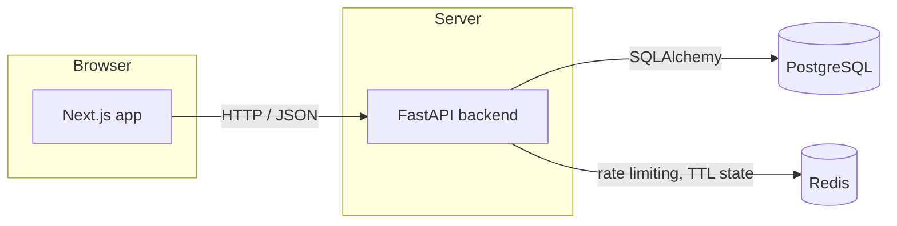
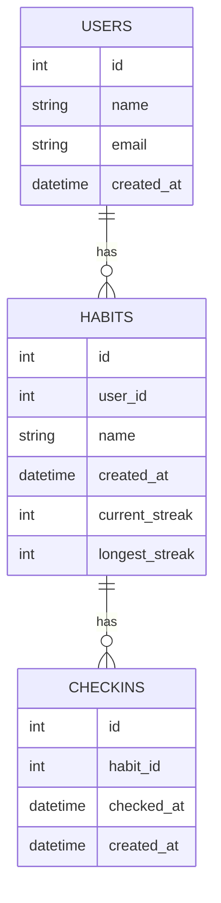

# Habit Tracker

This repo is the starting point for a design engineering interview at Focus Tiger. If you're a candidate, see [Preparing for the interview](#preparing-for-the-interview) below.

A small habit-tracking app. Users have habits, and check in on them day to day to build up a streak.

## Tech stack

- **Backend:** FastAPI (Python), SQLAlchemy, Alembic for migrations
- **Database:** PostgreSQL
- **Cache / short-lived state:** Redis
- **Frontend:** Next.js (App Router) with TypeScript and Tailwind CSS

## Getting started

Everything runs through Docker Compose, no local Python or Node install required.

```bash
docker compose up
```

Then open [http://localhost:3000](http://localhost:3000).

The database is seeded automatically with a demo user and a handful of habits the first time it starts up. The backend API runs at [http://localhost:8000](http://localhost:8000).

## Architecture



## Data model



## Preparing for the interview

Before the interview, please:

1. Clone this repo.
2. Run `docker compose up` and confirm it comes up cleanly, the frontend loads at [http://localhost:3000](http://localhost:3000) and shows seeded habits.

That's the only preparation needed, there's no need to read through the codebase or design anything in advance. During the interview, we'll give you a design problem around this app. You'll design a solution and then build it on top of what's here. We're mostly interested in your design thinking and craft, and in how you carry your ideas through into working software.

The current UI is intentionally minimal, so don't treat it as the quality bar. Brand colors and fonts are in `frontend/tailwind.config.ts`, and the UI lives in `frontend/app/page.tsx`.

Bring whatever design and AI tools you're most comfortable with. You're expected and encouraged to use AI throughout, for both designing and building.
